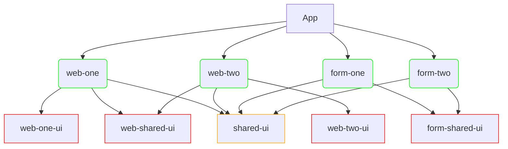

# Nx19Ng18MatApps

<a alt="Nx logo" href="https://nx.dev" target="_blank" rel="noreferrer"></a>

✨ Your new, shiny [Nx workspace](https://nx.dev) is ready ✨.

```shell
npx create-nx-workspace@19

# add application
npx nx g @nx/angular:app apps/web-two --skip-tests

# add lib
## prefix=lib-*
npx nx g @nx/angular:library shared-ui --directory libs/shared/ui --prefix <PROJECT_PREFIX> --style scss --skip-tests

# generate component in ui lib
npx nx generate @schematics/angular:component --name=<NAME> --project=<PROJECT_NAME> --style=scss --skip-tests


```

### Angular Libraries
- Feature Type
- Data-access Type
  ```shell
  npx nx g @nx/angular:library form-shared-data-access --directory libs/form/shared/data-access --prefix lib-form-shared-data-access

  npx nx g @nx/angular:library shared-data-access --directory libs/shared/data-access --prefix lib-shared-data-access
  ```
- UI Type


## Code Organization
### Flowchart

### CLI
- Generate angular library (check in project.json)
  ```shell
  # libs/shared/ui
  --name=shared-ui #=project name
  --prefix=lib-shared-ui
  ```
### Structure
- apps
  - web-one
  - web-two
  - form-one
  - form-two
- libs
  - web
    - web-one
      - ui `lib-web-one-ui`
        - banner-custom
    - web-two
      - ui `lib-web-two-ui`
        - alert-custom
    - shared
      - ui `lib-web-shared-ui`
        - *dialog-override*
      - data-access
  - form
    - shared
      - feat-ui-controls
      - feat-ui-controls-2
      - ui `lib-form-shared-ui`
        - *form-field-override*
      - data-access
  - shared
    - ui `lib-shared-ui`
      - *button-group*
    - data-access

### Styles & Themes
- web-one
  - m3 custom theme
- web-two
  - m3 custom theme
- form-one
  - prebuilt theme
- form-two
  - custom theme
